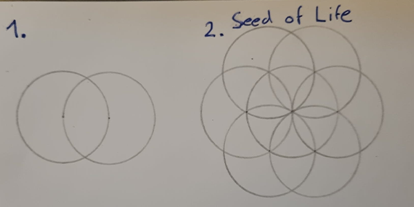
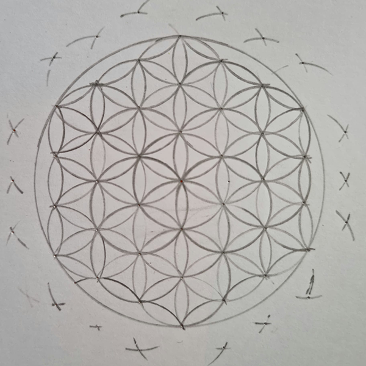

# Day 01

## Computing without computer

## Intro

Today's topic was very open.  I have been interested in meditation for a long time, and the flower of life is a reoccurring symbol. It is a basic shape consisting of overlapping circles. The oldest-known example of the Flower Of Life is at least 6000 years old and dates all the way back to Ancient Egypt.
So I tried to recreate the flower of life in javascript. To get a better idea of the shape, I sketched one with pencil and paper.

## Seed of Life

To draw a flower of life, start with a circle. Now draw another circle with the same radius, whose center is on the line of the first circle. Repeat this 5 times at the intersections of the circles.
around the first circle. The shape that emerges is called the Seed of Life.

### Sketch



### P5.js



<iframe src="projects/Day1_Intro/SeedOfLife/index.html" width="100%" height="300" frameborder="no"></iframe>


### Code

```js
function drawSeed() {
  circle(0, 0, diameter);
  push();
  translate(radius, 0);
  circle(0, 0, diameter);
  pop();
  push();
  translate(-radius, 0);
  circle(0, 0, diameter);
  pop();
  push();
  translate(radius / 2, (Math.sqrt(3) / 2) * radius);
  circle(0, 0, diameter);
  pop();
  push();
  translate(-radius / 2, (Math.sqrt(3) / 2) * radius);
  circle(0, 0, diameter);
  pop();
  push();
  translate(radius / 2, -(Math.sqrt(3) / 2) * radius);
  circle(0, 0, diameter);
  pop();
  push();
  translate(-radius / 2, -(Math.sqrt(3) / 2) * radius);
  circle(0, 0, diameter);
  pop();
}
```

### FLower of Life




<iframe src="projects/Day1_Intro/FlowerofLife/index.html" width="100%" height="600" frameborder="no"></iframe>


## Computing with computer

Lorem ipsum dolor sit amet, consetetur sadipscing elitr, sed diam nonumy eirmod tempor invidunt ut labore et dolore magna aliquyam erat, sed diam voluptua. At vero eos et accusam et justo duo dolores et ea rebum. Stet clita kasd gubergren, no sea takimata sanctus est Lorem ipsum dolor sit amet. Lorem ipsum dolor sit amet, consetetur sadipscing elitr, sed diam nonumy eirmod tempor invidunt ut labore et dolore magna aliquyam erat, sed diam voluptua.

> At vero eos et accusam et justo duo dolores et ea rebum. Stet clita kasd gubergren, no sea takimata sanctus est Lorem ipsum dolor sit amet. Lorem ipsum dolor sit amet, consetetur sadipscing elitr, sed diam nonumy eirmod tempor invidunt ut labore et dolore magna aliquyam erat, sed diam voluptua.



<iframe src="content/day01/02/embed.html" width="100%" height="450" frameborder="no"></iframe>


- Lorem ipsum dolor sit amet
- Consetetur sadipscing elitr, sed diam nonumy.
- At vero eos et accusam et justo duo dolores et ea rebum.
