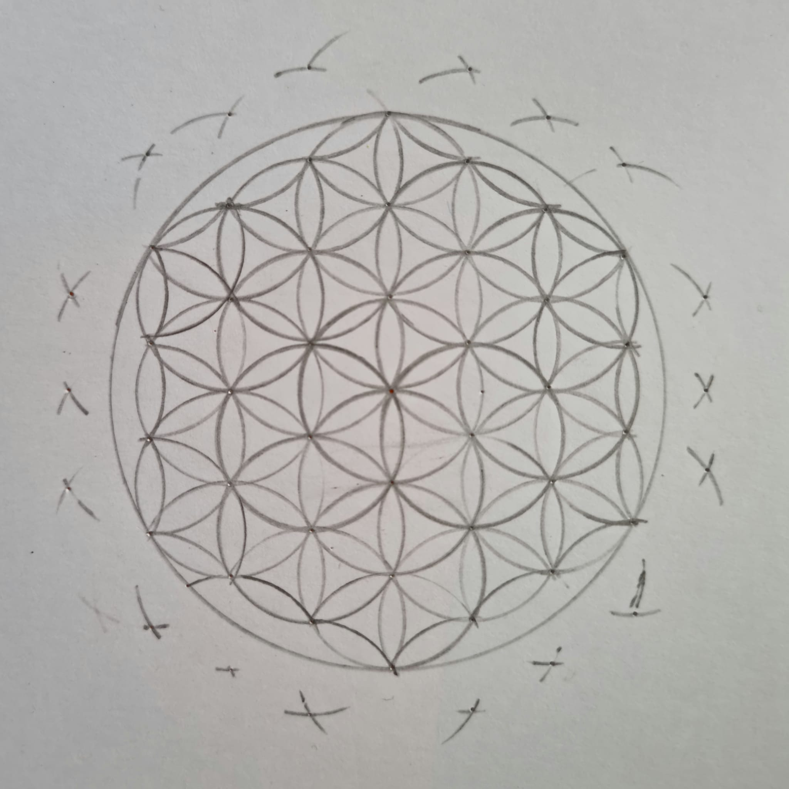

# Day 01

## Computing without computer

### Sprouts

First we played a simple game. It starts with drawing two or more points on a sheeet. Now the first Player has to draw a line which connects them both and draw a new point on this connecting line. The second Player has to do the same



```js
// Javascript code with syntax highlighting.
var fun = function lang(l) {
  dateformat.i18n = require("./lang/" + l);
  return true;
};
```

### FLower of Life



<iframe src="projects/Day1_Intro/FlowerofLife/index.html" width="100%" height="450" frameborder="no"></iframe>


## Computing with computer

Lorem ipsum dolor sit amet, consetetur sadipscing elitr, sed diam nonumy eirmod tempor invidunt ut labore et dolore magna aliquyam erat, sed diam voluptua. At vero eos et accusam et justo duo dolores et ea rebum. Stet clita kasd gubergren, no sea takimata sanctus est Lorem ipsum dolor sit amet. Lorem ipsum dolor sit amet, consetetur sadipscing elitr, sed diam nonumy eirmod tempor invidunt ut labore et dolore magna aliquyam erat, sed diam voluptua.

> At vero eos et accusam et justo duo dolores et ea rebum. Stet clita kasd gubergren, no sea takimata sanctus est Lorem ipsum dolor sit amet. Lorem ipsum dolor sit amet, consetetur sadipscing elitr, sed diam nonumy eirmod tempor invidunt ut labore et dolore magna aliquyam erat, sed diam voluptua.



<iframe src="content/day01/02/embed.html" width="100%" height="450" frameborder="no"></iframe>


- Lorem ipsum dolor sit amet
- Consetetur sadipscing elitr, sed diam nonumy.
- At vero eos et accusam et justo duo dolores et ea rebum.
