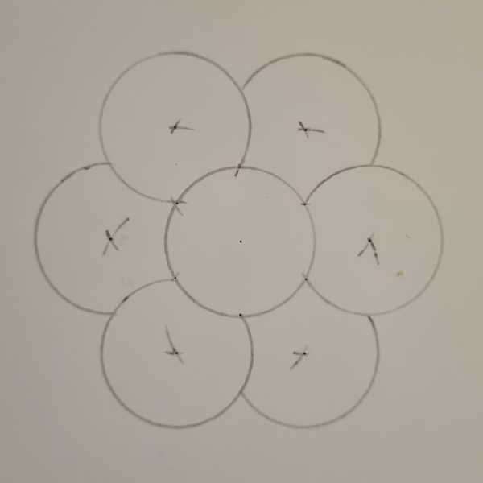
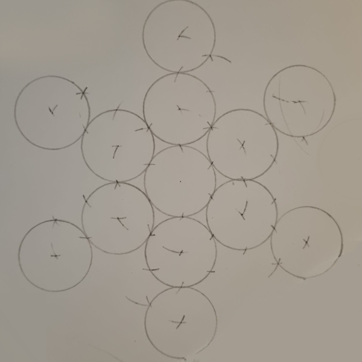
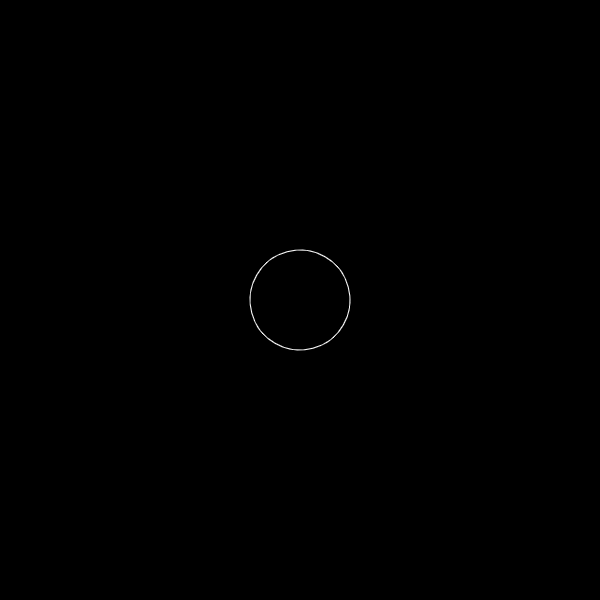

# Day 01

## Computing without computer

## Intro

Today's topic was very open.  I have been interested in meditation for a long time, and the flower of life is a reoccurring symbol. It is a basic shape consisting of overlapping circles. The oldest-known example of the Flower Of Life is at least 6000 years old and dates all the way back to Ancient Egypt.
I tried to recreate the flower of life in javascript. To get a better idea of the shape, I sketched one with pencil and paper.

## Seed of Life

To draw a flower of life, start with a circle. Now draw another circle with the same radius, whose center is on the line of the first circle. Repeat this 5 times at the intersections of the circles.
around the first circle. The shape that emerges is called the Seed of Life.

The ‘Seed of Life’ is formed from seven circles being placed with sixfold symmetry, forming a pattern of circles and lenses, which acts as a basic component of the Flower of Life’s design. According to some, the seed of life depicts the 7 days of creation in which God created life.(https://www.tokenrock.com/subjects/flower-of-life/)

### Sketch


### P5.js



<iframe src="projects/Day1_Intro/SeedOfLife/index.html" width="100%" height="300" frameborder="no"></iframe>


### Code

simple code with many repetitions

```js
function drawSeed() {
  circle(0, 0, diameter);
  push();
  translate(radius, 0);
  circle(0, 0, diameter);
  pop();
  push();
  translate(-radius, 0);
  circle(0, 0, diameter);
  pop();
  push();
  translate(radius / 2, (Math.sqrt(3) / 2) * radius);
  circle(0, 0, diameter);
  pop();
  push();
  translate(-radius / 2, (Math.sqrt(3) / 2) * radius);
  circle(0, 0, diameter);
  pop();
  push();
  translate(radius / 2, -(Math.sqrt(3) / 2) * radius);
  circle(0, 0, diameter);
  pop();
  push();
  translate(-radius / 2, -(Math.sqrt(3) / 2) * radius);
  circle(0, 0, diameter);
  pop();
}
```

simplification with for-loop

```js
function drawSeed4() {
  circle(0, 0, diameter);
  push();
  translate(radius, 0);
  rotate(300);
  for (let i = 0; i < 6; i++) {
    circle(0, 0, diameter);
    rotate(300);
    translate(radius, 0);
  }
  pop();
}
```

## Egg of Life

The ‘Egg of Life’ is also a symbol composed of seven circles taken from the design of the Flower of Life. The shape of the Egg of Life is said to be the shape of a multi-cellular embryo in its first hours of creation.(https://www.tokenrock.com/subjects/flower-of-life/)

### Sketch



### P5.js



<iframe src="projects/Day1_Intro/EggOfLife/index.html" width="100%" height="600" frameborder="no"></iframe>


### Code

The Egg of Life consists of a central circle surrounded by 6 overlapping circles. These circles do not lie on the edge of the circle, as is the case with the Seed of Life.

The Background is Code from https://happycoding.io/examples/p5js/for-loops/vertical-gradient to make it a little bit more interesting.

```js
function drawEggOfLife2() {
  let length = 2 * radius * sin(120 / 2);
  for (let i = 0; i < 2; i++) {
    rotate(60);
    for (let i = 0; i < 3; i++) {
      push();
      translate(length, 0);
      circle(0, 0, diameter);
      pop();
      rotate(120);
    }
  }
  circle(0, 0, diameter);
}
```

## Fruit of Life

The ‘Fruit of Life’ symbol is composed of 13 circles taken from the design of the Flower of Life. It is said to be the blueprint of the universe, containing the basis for the design of every atom, molecular structure, life form, and everything in existence. It contains the geometric basis for the delineation of Metatron’s Cube, which brings forth the platonic solids.(https://www.tokenrock.com/subjects/flower-of-life/)

### Sketch



### P5.js



<iframe src="projects/Day1_Intro/FruitofLife/index.html" width="100%" height="600" frameborder="no"></iframe>


### Code

```js
function drawFruitOfLife() {
  circle(0, 0, diameter);
  for (let i = 0; i < 6; i++) {
    push();
    for (let j = 0; j < 2; j++) {
      translate(radius * 2, 0);
      circle(0, 0, diameter);
    }
    pop();
    rotate(360 / 6);
  }
}
```

## Flower of Life

The flower of life is a geometrical shape composed of multiple evenly-spaced, overlapping circles arranged in a flower like pattern with six fold symmetry like a hexagon. The perfect form, proportion and harmony of the FOL has been known to philosophers, architects and artist around the world. Pagans consider it to be sacred geometry containing ancient religious value depicting the fundamental forms of space and time. In the pagan sense, it is believed to contain a type of Akashic Record of basic information of all living things and is the visual expression of the connections of life that run through all sentient beings.

In New Age thought, the Flower of Life has provided what is considered to be deep spiritual meaning and forms of enlightenment to those who have studied it as sacred geometry. There are groups of people all over the world who derive particular beliefs and forms of meditation based (at least in part) on the Flower of Life.

The flower of life symbol represents important meaning to many throughout history. The symbol can be found in manuscripts, temples and art throughout cultures around the world.
The most common form of the ‘Flower of Life’ is hexagonal pattern (where the center of each circle is on the circumference of six surrounding circles of the same diameter), made up of 19 complete circles and 36 partial circular arcs, enclosed by a large circle..(https://www.tokenrock.com/subjects/flower-of-life/)

### Sketch


### P5.js



<iframe src="projects/Day1_Intro/FlowerofLife/index.html" width="100%" height="600" frameborder="no"></iframe>


### Code

```js
function drawSeed() {
  circle(0, 0, diameter);
  push();
  translate(radius, 0);
  rotate(300);
  for (let i = 0; i < 6; i++) {
    circle(0, 0, diameter);
    rotate(300);
    translate(radius, 0);
  }
  pop();
}

function drawFlower() {
  push();
  translate(radius, 0);
  rotate(300);
  for (let i = 0; i < 6; i++) {
    drawSeed();
    rotate(300);
    translate(radius, 0);
  }
  pop();
}
```


