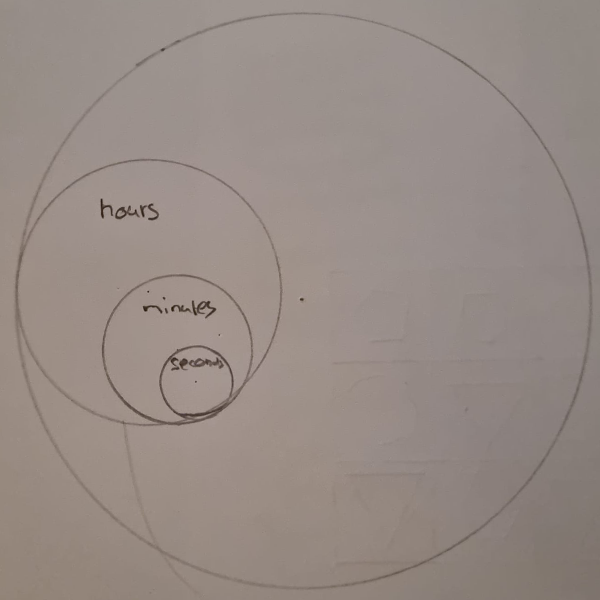

# Day 03

## Clock

### Brief

Today we’ll work on building a device visualising the passing of time. Your design should be abstract enough and appear different at all times of the day. It should incorporate some kind of cycles as well. You should prevent from using letter and digits unless it’s highly relevant with your concept and used in a unique way.

While designing your clock ponder things like biological time (chronobiology), ultradian rhythms and infradian rhythms, solar and lunar cycles, celestial time, geological time, decimal time, historical time, psychological time, and subjective time.

## Concept

My idea was to represent time using circles. The circles act as clock hands, like on an analog clock. However, to make it original, the circles are nested inside each other.



## Clock Prototype



<iframe src="projects/Day3_Clock/Clock_1/index.html" width="100%" height="450" frameborder="no"></iframe>


### Code

```js
function draw() {
  background(200);

  const now = new Date();
  const [seconds, minutes, hours] = [
    now.getSeconds(),
    now.getMinutes(),
    now.getHours(),
  ];
  // Outer Circle
  stroke(0);
  noFill();
  circle(width / 2, height / 2, diameter);

  // Hours
  push();
  if (hours > 12) {
    hAngle = map(hours, 0, 11, 0, 330);
  } else {
    hAngle = map(hours, 12, 23, 0, 330);
  }
  fill(0, 0, 255);
  translate(width / 2, height / 2);
  translate(p5.Vector.fromAngle(radians(hAngle - 90), radius - hRadius));
  circle(0, 0, hDiameter);
  pop();

  // Minutes
  push();
  fill(0, 255, 0);
  mAngle = map(minutes, 0, 59, 0, 354);
  translate(width / 2, height / 2);
  translate(p5.Vector.fromAngle(radians(mAngle - 90), radius - mRadius));
  circle(0, 0, mDiameter);
  pop();

  // Seconds
  push();
  fill(255, 0, 0);
  sAngle = map(seconds, 0, 59, 0, 354);
  translate(width / 2, height / 2);
  translate(p5.Vector.fromAngle(radians(sAngle - 90), radius - sDiameter / 2));
  circle(0, 0, sDiameter);
  pop();
}
```

## Clock Final



<iframe src="projects/Day3_Clock/Clock_1.1/index.html" width="100%" height="450" frameborder="no"></iframe>


### Code

```js
  // Hours
  //map-Funktion um den Studen einen Winkel zuzuordnen
  if (hours > 12) {
    hAngle = map(hours, 0, 11, 0, 330);
  } else {
    hAngle = map(hours, 12, 23, 0, 330);
  }
  translate(width / 2, height / 2);
  //Translate (winkel , länge)
  translate(p5.Vector.fromAngle(radians(hAngle - 90), radius - hRadius));
  circle(0, 0, hDiameter);

  // Minutes
  mAngle = map(minutes, 0, 59, 0, 354);
  translate(p5.Vector.fromAngle(radians(mAngle - 90), hRadius - mRadius));
  circle(0, 0, mDiameter);

  // Seconds
  sAngle = map(seconds, 0, 59, 0, 354);
  translate(p5.Vector.fromAngle(radians(sAngle - 90), mRadius - sRadius));
  circle(0, 0, sDiameter);
}
```

## Clock with proportions

Here the area of the circles was adapted to the proportions. That is, the area of the minute circle fits 60 times in the hour circle, etc..



<iframe src="projects/Day3_Clock/Clock_1.2/index.html" width="100%" height="450" frameborder="no"></iframe>


### Code

```js
function setup() {
  createCanvas(windowWidth, windowHeight);
  angleMode(DEGREES);
  diameter = min(width, height) * 0.9;
  radius = diameter / 2;
  hDiameter = diameter / 4.8989;
  hRadius = hDiameter / 2;
  mDiameter = hDiameter / 7.7459;
  mRadius = mDiameter / 2;
  sDiameter = mDiameter / 7.7459;
  sRadius = sDiameter / 2;
  opacity = 100;
}
```
