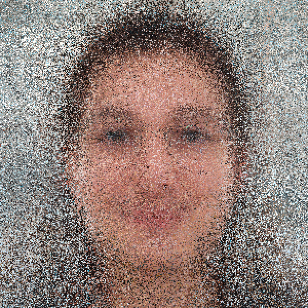

# Day 05

## Face Generator

### Brief

Create a program that is generating a parametric face. Your face should at least be controlled by 3 parameters but preferably more. Variations in some of the features can be used to control the expressiveness of the face or some other characteristics (species, gender, etc…) Differentiate continuous parameters (size and position of features) and discrete parameters (piercing, number of eyeballs). Consider the space you’re generating your face in (2D / 3D) and the view angle, front, profile, 3/4?

## Concept

My intial idea was to create a Face Generator, which creates a new Face using multiple Pictures. In the Sketch you will see that i wanted to start simple with one Column and 4 Rows.


## Input

I needed some Pictures which I could use as an Input. So i searched a few Portraits on Google and then lined them up in Photoshop by using a Mask. Then i had the Idea to take pictures of me and my classmates to make it a little bit more intereesting.


## Prototype

I started to create a Prototype which works like my Concept. Thet means it splits the Image in four Rows and then uses a random Picture for each part. Since my library consists of only 17 images, it can happen that an image is used several times.



<iframe src="projects/Day5_Faces/facegenerator_v1/index.html" width="100%" height="600" frameborder="no"></iframe>


### Code

Here is the most important Code used for the Prototype.

random(faces); gets a random Image out of the Array Faces  
img.get(startX, startY, width, height); gets the defined Part of the Picture  
image(img, x, y); draws the picture on the defined x,y-coordinates

```js
//Function to generate an image from four pictures.
function generatePicture() {
  //Top
  let top = (0, 0, width, height / 4);
  image(top, 0, 0);
  //Eyes
  let eyes = random(faces).get(0, height / 4, width, height / 4);
  image(eyes, 0, height / 4);
  //Nose
  let nose = random(faces).get(0, height / 2, width, height / 4);
  image(nose, 0, height / 2);
  //Chin
  let chin = random(faces).get(0, (height / 4) * 3, width, height / 4);
  image(chin, 0, (height / 4) * 3);
}
```

In this code, many commands are repeated, which can be simplified in a for-loop. This could look something like this.

```js
  for (let i = 0; i < rows; i++) {
    row[i] = random(faces).get(0, (i * height) / rows, width, height / rows);
    image(row[i], 0, (i * height) / rows);
  }
}
```

## Final product

In the final product I wanted not only rows but also collums which can be adjusted in real time. I was able to do this with a nested loop similar to the grid project. The Colums and Rows are controlled with 2 sliders.


<iframe src="projects\Day5_Faces\facegenerator_1.2\index.html" width="100%" height="600" frameborder="no"></iframe>


### Code

First, all source images are loaded in the preload function. This is done by a For-Loop which loops through the number of images (imageCount).

```js
let faces = [];
let colsSlider;
let cols;
let rowsSlider;
let rows;
let imageCount = 19;

function preload() {
  for (let i = 0; i < imageCount; i++) {
    faces[i] = loadImage("images/Face_" + i + ".png");
  }
}
```

The canvas is now created in the setup. I worked with 1200 x 1200 pixel images, so the images here are resized to 600 x 600 pixel.
I did this step so that the sketches fit well into the documentation.
After that, the two sliders for Columns and Rows are created. For performance reasons, these only reach up to 70, whereby a 70 x 70 image can also lead to a loading time. At the end of the block a first image is generated and the reset-button is inizialized.

```js
function setup() {
  createCanvas(600, 600);
  background(145);
  //Resizing the Images
  for (let i = 0; i < imageCount; i++) {
    faces[i].resize(600, 600);
  }

  colsSlider = createSlider(1, 70, 7, 1);
  colsSlider.position(15, height * 0.95);
  rowsSlider = createSlider(1, 70, 7, 1);
  rowsSlider.position(width - 140, height * 0.95);
  generatePicture();
  let button = createButton("Generate");
  button.mousePressed(generatePicture);
  button.position(width / 2, height * 0.93);
}
```

The draw function only checks if the sliders have been adjusted, if so a new image is generated.

```js
function draw() {
  colsSlider.changed(generatePicture);
  rowsSlider.changed(generatePicture);
}
```

Now to the main function generatePicture().
At the beginning the rows and columns are adjusted to the current values of the slider. Now each row and column is looped and the random image sections are printed.

```js
//Function to generate an image from four pictures.
function generatePicture() {
  cols = colsSlider.value();
  rows = rowsSlider.value();
  //Creating the Colums and Rows for
  for (let i = 0; i < rows; i++) {
    for (let j = 0; j < cols; j++) {
      let pic = random(faces).get(
        (j * width) / cols,
        (i * height) / rows,
        width / cols,
        height / rows
      );
      image(pic, (j * width) / cols, (i * height) / rows);
    }
  }
}
```

### Special Outcome

I ran tests with 300 x 300 fields per image. The more colums and rows you set, the more likely the final result will look the same.
However, the image usually took more than 30 seconds to render. So I rendered 10 images and turned them into a gif. The final result can be seen here.


