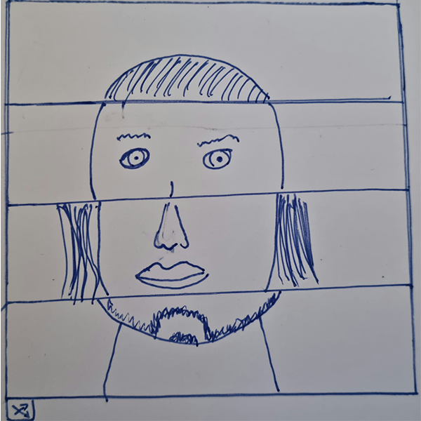
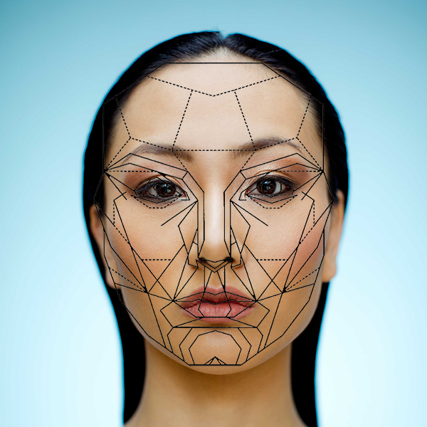

# Day 05

## Face Generator

### Brief

Create a program that is generating a parametric face. Your face should at least be controlled by 3 parameters but preferably more. Variations in some of the features can be used to control the expressiveness of the face or some other characteristics (species, gender, etc…) Differentiate continuous parameters (size and position of features) and discrete parameters (piercing, number of eyeballs). Consider the space you’re generating your face in (2D / 3D) and the view angle, front, profile, 3/4?

### Concept

My intial idea was to create a Face Generator, which creates a new Face using multiple Pictures. In the Sketch you will see that i wanted to start simple with one Column and 4 Rows.



### Input

I needed some Pictures which I could use as an Input. So i searched a few Portraits on Google and then lined them up in Photoshop by using a Mask. Then i had the Idea to take pictures of me and my classmates to make it a little bit more intereesting.



### Prototype

I started to create a Prototype which works like my Concept. Thet means it splits the Image in four Rows and then uses a random Picture for each part. Since my library consists of only 17 images, it can happen that an image is used several times.



<iframe src="projects/Day5_Faces/facegenerator_v1/index.html" width="100%" height="600" frameborder="no"></iframe>


Here is the most important Code used for the Prototype.

random(faces); gets a random Image out of the Array Faces
img.get(startX, startY, width, height); gets the defined Part of the Picture
image(img, x, y); draws the picture on the defined x,y-coordinates

```js
//Function to generate an image from four pictures.
function generatePicture() {
  //Top
  let top = (0, 0, width, height / 4);
  image(top, 0, 0);
  //Eyes
  let eyes = random(faces).get(0, height / 4, width, height / 4);
  image(eyes, 0, height / 4);
  //Nose
  let nose = random(faces).get(0, height / 2, width, height / 4);
  image(nose, 0, height / 2);
  //Chin
  let chin = random(faces).get(0, (height / 4) * 3, width, height / 4);
  image(chin, 0, (height / 4) * 3);
}
```

### Moniker

Lorem ipsum dolor sit amet, consetetur sadipscing elitr, sed diam nonumy eirmod tempor invidunt ut labore et dolore magna aliquyam erat, sed diam voluptua. At vero eos et accusam et justo duo dolores et ea rebum. Stet clita kasd gubergren, no sea takimata sanctus est Lorem ipsum dolor sit amet. Lorem ipsum dolor sit amet, consetetur sadipscing elitr, sed diam nonumy eirmod tempor invidunt ut labore et dolore magna aliquyam erat, sed diam voluptua.

## Computing with computer

Lorem ipsum dolor sit amet, consetetur sadipscing elitr, sed diam nonumy eirmod tempor invidunt ut labore et dolore magna aliquyam erat, sed diam voluptua. At vero eos et accusam et justo duo dolores et ea rebum. Stet clita kasd gubergren, no sea takimata sanctus est Lorem ipsum dolor sit amet. Lorem ipsum dolor sit amet, consetetur sadipscing elitr, sed diam nonumy eirmod tempor invidunt ut labore et dolore magna aliquyam erat, sed diam voluptua.

> At vero eos et accusam et justo duo dolores et ea rebum. Stet clita kasd gubergren, no sea takimata sanctus est Lorem ipsum dolor sit amet. Lorem ipsum dolor sit amet, consetetur sadipscing elitr, sed diam nonumy eirmod tempor invidunt ut labore et dolore magna aliquyam erat, sed diam voluptua.

- Lorem ipsum dolor sit amet
- Consetetur sadipscing elitr, sed diam nonumy.
- At vero eos et accusam et justo duo dolores et ea rebum.



<iframe src="projects\Day5_Faces\facegenerator_1.2\index.html" width="100%" height="600" frameborder="no"></iframe>

