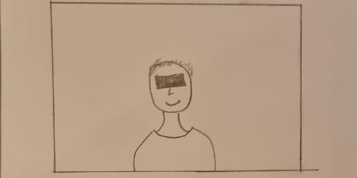

# Day 06

## Pixels

### Brief

Pixels are your materials for today. Use them as a starting point to create an original design. You can use their color values, position and other parameters in order to create an original work. What if pixels had different shapes? Or were arrange differently than in a nicely organised grid? What if they could be represented in a completely different form? Think carefully about the relationships between your pixel concept and the image you choose to transform.

## Concept

I wanted to use the Facelibrary. My idea was to censor/pixelate the eyes.



### Censoring Eyes



<iframe src="projects/Day6_Pixels/pixels_2/index.html" width="600" height="450" frameborder="no"></iframe>


### Code

```js
function drawFacesCensored(faces, filled) {
  for (let i = 0; i < faces.length; i++) {
    const keypoints = faces[i].scaledMesh;
    //Left Eye Coordinates(0,1,7,8)
    const [x0, y0, z0] = keypoints[0];
    //Right Eye Coordinates(2,3,9,10)
    const [x3, y3, z3] = keypoints[3];
    //
    let cWidth = 1.3;
    let product = Math.pow(x3 - x0, 2) + Math.pow(y3 - y0, 2);
    let lengthEyes = Math.sqrt(product) * cWidth;
    let cencorHeight = 40;

    let eyesCenterX = (x0 + x3) / 2;
    let eyesCenterY = (y0 + y3) / 2;
    translate(eyesCenterX, eyesCenterY);
    //Calculates angle from the center to the right eye
    let angle = atan2(y3 - eyesCenterY, x3 - eyesCenterX);
    rotate(angle);
    noStroke();
    fill("black");
    rect(-lengthEyes / 2, -cencorHeight / 2, lengthEyes, cencorHeight);
  }
```
